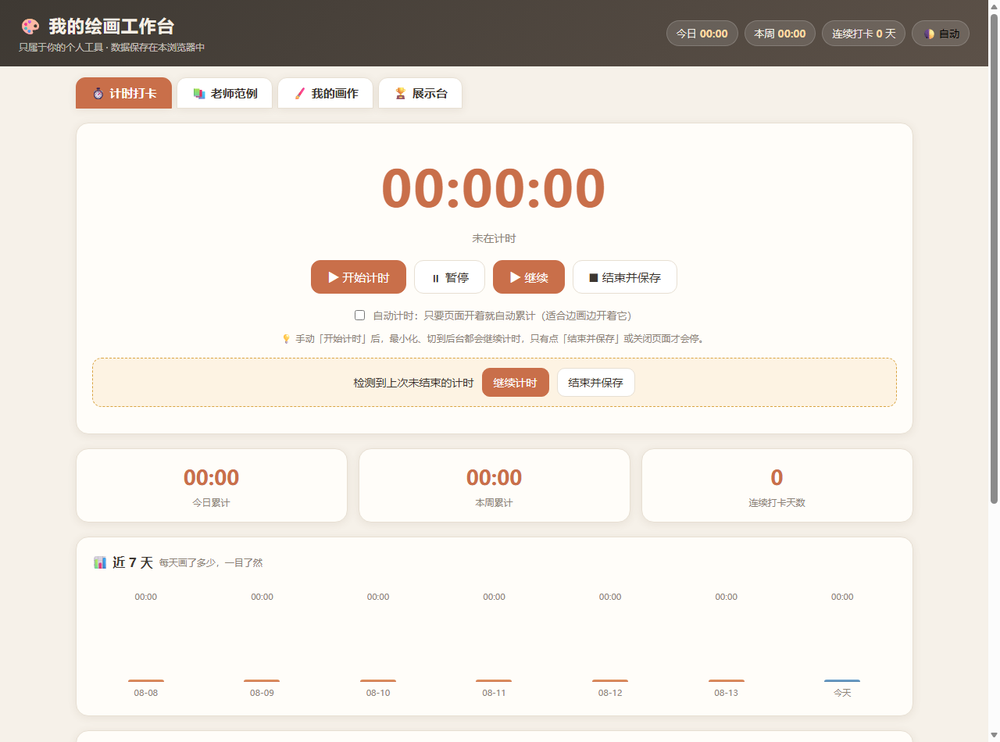
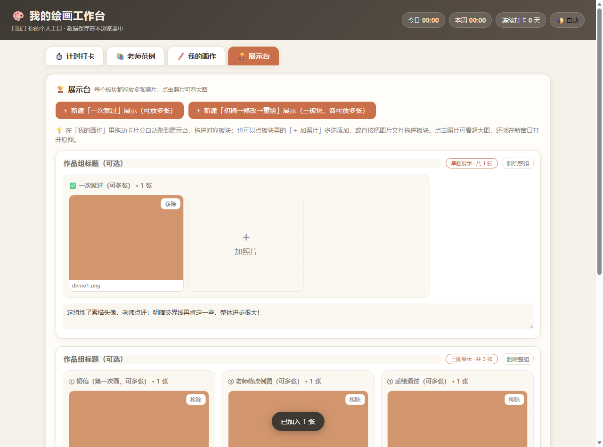
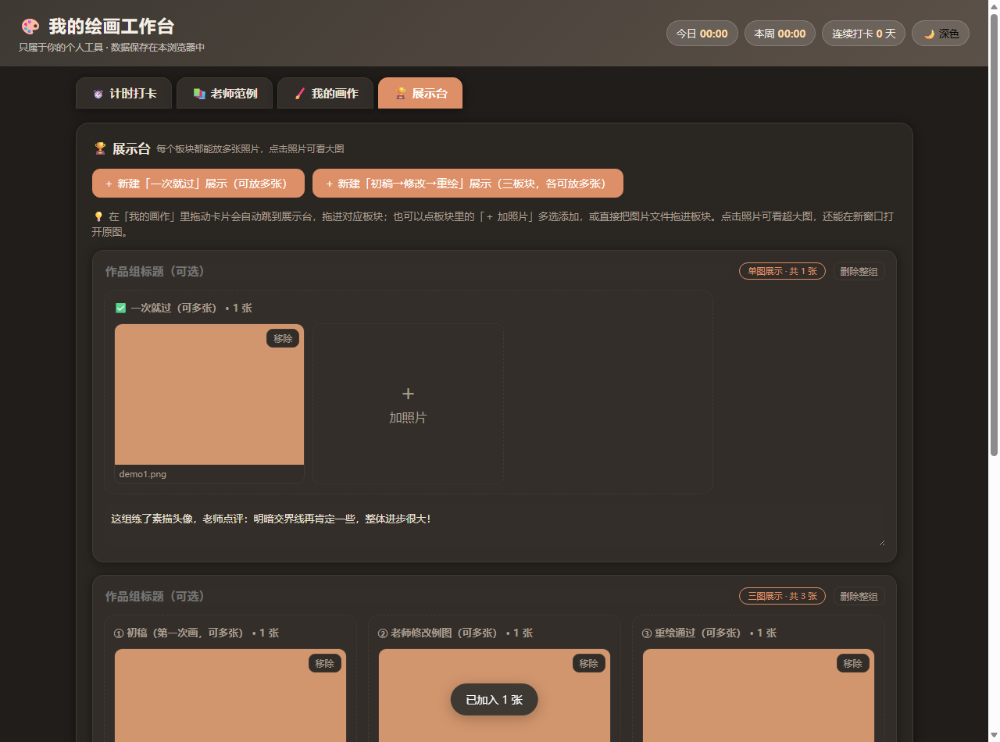

# 我的绘画工作台 · Paint Workbench

一个给自己画画练习用的**本地工作台**：记录每次练习时长、看近期练习趋势、归档作品、写练习笔记。

**单个 HTML 文件，零依赖、零构建、零后端**——双击即可用，数据全部存在浏览器本地（IndexedDB），不联网、不上传。

## 在线体验

https://024bb0c4d8d64695b7f852cf63aec87b.app.workbuddy.host

> 首次打开会看到一组**演示数据**（页面顶部有明确标注，并带「清空演示数据」按钮）。
> 演示数据只为让首次访问不至于是一片空表，点击清除后即恢复真实空状态。

## 截图

| 主界面 | 展示台 | 深色主题 |
|---|---|---|
|  |  |  |

## 功能

- **计时打卡**：开始 / 暂停 / 结束一次练习，自动落库为一条会话记录（起止时间 + 时长 + 备注）
- **近 7 天趋势图**：用 div + CSS 高度自绘的时长柱状图，不需要任何图表库
- **作品归档**：拖拽文件或 Ctrl+V 直接粘贴上传，按分组管理展示台
- **练习笔记**：随手记录心得，与作品、会话分表存储
- **IndexedDB 三存储持久化**：`images` / `sessions` / `notes` 三个对象仓库互不干扰
- **JSON 备份**：一键导出 / 导入，换浏览器或换设备不丢数据
- **三套主题**：浅色 / 深色 / 展示台模式

## 技术要点

| 项 | 选择与理由 |
|---|---|
| 框架 | 无。原生 HTML/CSS/JS 单文件，全部内联 |
| 存储 | IndexedDB（三个 object store），可存图片 Blob，容量远大于 localStorage |
| 图表 | 用 `div` + CSS 百分比高度手写柱状图，避免引入 Chart.js 这类外部依赖 |
| 图标 | 内联 base64，**全文件 0 处外部网络请求**（可离线打开） |
| 体积 | 约 72 KB，单文件 |

`index.html` 里**没有任何 CDN、字体、接口调用**，把它拷到 U 盘也能跑。

## 运行

```bash
# 方式一：直接双击 index.html

# 方式二：起一个静态服务器（推荐，避免个别浏览器对 file:// 的 IndexedDB 限制）
python -m http.server 8000
# 然后打开 http://127.0.0.1:8000
```

## 目录结构

```
paint-workbench/
├── index.html              # 全部代码（HTML + CSS + JS + 图标）
├── assets/
│   ├── app-icon.svg        # 应用图标（矢量）
│   ├── app-icon.png
│   └── app-icon.ico
├── screenshots/
│   ├── 01-main.png
│   ├── 02-showcase.png
│   └── 03-dark-theme.png
└── README.md
```

## 关于开发方式

本项目由我提出需求、定义功能与交互，并借助 AI 编码工具协作完成实现与调试。
选择「单文件、零依赖」这个技术约束也是我的决定——目的是让它成为一个**不需要任何环境就能长期使用**的个人工具。

## 版权

本仓库未附带开源许可证，保留所有权利（All rights reserved）。
